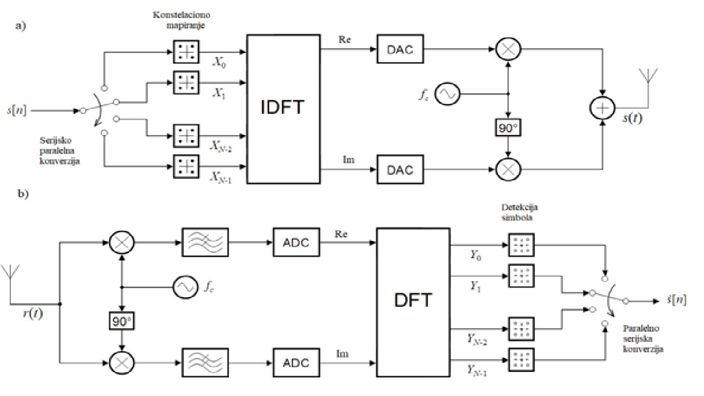

# EndToEndOFDM
## OFDM
OFDM (Orthogonal Frequency Division Multiplexing) je ključni element kako 4G (LTE), tako i narednih generacija mobilnih komunikacija, 
pa ćemo  pružiti osnovne informacije vezane za njega.OFDM se koristi i u tehnologijama 
kao što su WiMAX i DVB. OFDM je tehnika modulacije koja koristi više paralelnih podnosioca 
(subcarrier) koji su međusobno ortogonalni,kako bi se redukovala njihova interferencija.
Ortogonalnost podnosioca znači da je integral proizvoda dva različita podnosioca po jednom 
periodu jednak nuli.Ortogonalni podnosioci se obično realizuju korišćenjem  IFFT 
operacije koja predstavlja numerički efikasnu implementaciju Inverzne Diskretne Furijeove 
transformacije (IDFT).
## Osnovno o projektu
U ovom projektu modelovan je kompletan OFDM sistem koji uključuje predajnik, prenosni
radio kanal i prijemnik. Prikazan je detaljno postupak prenošenja jednog OFDM bloka
kroz sistem. Sistem se sastoji iz predajnika,prenosnog kanala i prijemnika. 
Niz bitova se dovodi na ulaz sistema. Ovaj niz se zatim deli u blokove odgovarajuće 
veličine za QAM modulaciju. Svaki blok bitova predstavlja QAM simbol. QAM simboli se 
raspoređuju na različite OFDM podnosioce. Svaki podnosioc prenosi jedan QAM simbol.Sledeći 
korak je primena IFFT na skup QAM simbola za generisanje OFDM signala u vremenskom domenu.
Zatim se ciklični prefiks dodaje na početak svakog OFDM bloka u vremenskom domenu.OFDM signal
u vremenskom domenu treba sa se moduliše na radio-frekvencijski (RF) noseći signal. Prethodno
se vrši pretvaranje digitalnog signala u analogni. Ovaj korak se izvodi pomoću digitalno-analognog 
konvertera (DAC). Analogni OFDM signal se zatim moduliše na RF noseći signal. Nakon modulacije na 
RF nosioc, signal se prenosi kroz bežični kanal koji uvodi različite vrste degradacija (feding,
Doplerov efekat usled relativnog kretanja predajnika i prijemnika, šum). Na strani pijemnika vrši
se najpre demodulacija i ADC konverzija. Zatim se eliminišu ciklični prefiksi, pa se onda na
digitalni signal  zatim primenjuje brza Furijeova transformacija (FFT) da bi se dobile 
“frekvencijske“  komponente (QAM simboli) svakog podnosioca. Poslednji korak je demapiranje
QAM-a kako bi se povratili originalni bitovi podataka.

## Reference
[1] Shahrokh Hamidi,End-to-End OFDM Simulation in Python for a SISO Communication System,
https://www.researchgate.net/publication/382795116_End-to-End_OFDM_Simulation_in_Python_for_a_SISO_Communication_System

[2] Branislav Todorović, Osnove telekomunikacija, Akademska misao, Beograd, 2021

[3] David Tse, and Pramod Viswanath, Fundamentals of Wireless Communication, Cambridge University Press, Cambridge CB2 2RU, UK, 2005

[4] Learning DSP Illustrated https://dspillustrations.com/pages/index.html
